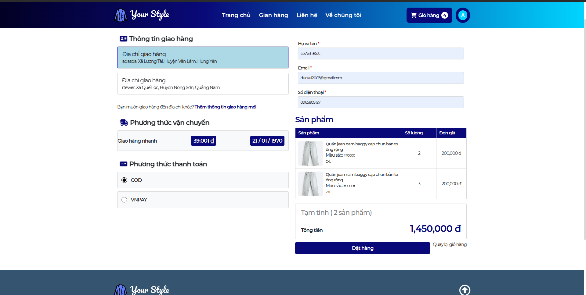
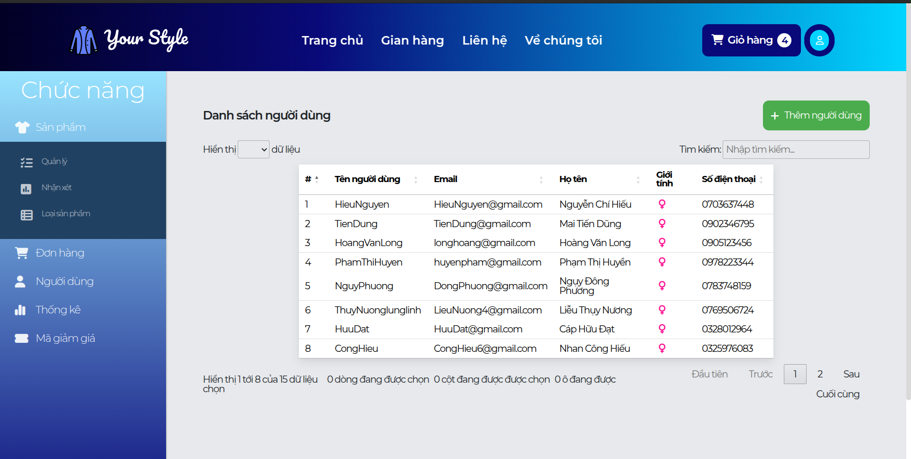

<h1>Table of Contents</h1>

- [Introduction](#introduction)
- [Tech stack](#tech-stack)
- [Installation](#installation)
  - [Manual](#manual)
  - [Docker](#docker)
- [UI Preview](#ui-preview)

# Introduction

This project is built during leaning in my university. Main purpose is supporting for my lesson and I has joined 3 process of this project (I mention below)

Project is started from 9/2023 to here, and has 3 team build and maintain it.

- 9/2023 - 1/2024: Project use jsp (FE) and servlet (BE), team members is 3, [link](https://github.com/john9101/LTW_N15)
- 1/2024 - 6/2024: Project added bootstrap and lib related to JQuery to handle UI, refactoring folder structure in backend and apply multi new features, team members is 3, [link](https://github.com/21130449-NguyenKhaiNam/web-sell)
- 8/2024 - 12/2024: Migration project from servlet to spring boot and use jsp as view engine, team member is 3

# Tech stack

- JSP
- Bootstrap 5
- Java 21
- Spring Boot + Spring MVC
- MySQL 8.0
- Cloudinary

# Installation

## Manual

1. Clone the repo

   ```bash
     git clone https://github.com/ducvui2003/spring-mvc-sell-clothes.git
   ```

2. Prepared MySQL Server (8.0)
3. Run file [database.sql]("./database.sql") import data to mysql
4. Configuration database in `src/main/java/com/spring/resources/application.yml`

   ```application.yml
    spring:
      datasource:
        url: jdbc:mysql://localhost:3306/your_style
        username: root
        driver-class-name: com.mysql.cj.jdbc.Driver
        password: password
   ```

5. Install lib in maven

   ```
    mvn clean install
   ```

6. Run project

   ```
    mvn spring-boot:run
   ```

   Open http://localhost:8080 in a browser.

   Check application.properties for a custom port.

## Docker

1. Build target external

   ```
     ./mvnw clean package -DskipTests
   ```

2. Build image by Dockerfile

   ```
     docker build -t spring-mvc-web-sell:1.0
   ```

3. Run docker compose

   ```
   docker-compose --env-file .env --profile web-sell up --build
   ```

   Open http://localhost:8080 in a browser.

# Features

Role

- ADMIN
- USER

Table Features

| Features                                     | Module  | Role        |
| -------------------------------------------- | ------- | ----------- |
| Login                                        | Auth    | ALL         |
| Register                                     | Auth    | ALL         |
| Logout                                       | Auth    | ALL         |
| Verify                                       | Auth    | USER        |
| Forget password                              | Auth    | USER        |
| Reset password                               | Auth    | USER        |
| Change password                              | Auth    | USER        |
| Update profile                               | User    | USER        |
| Update Avatar                                | User    | USER        |
| Add address (use api address external)       | User    | USER        |
| Get products                                 | Product | ALL         |
| Find products                                | Product | ALL         |
| Get product detail                           | Product | ALL         |
| Add product to card                          | Cart    | USER, ADMIN |
| Change quantity cart item                    | Cart    | USER, ADMIN |
| Remove cart item                             | Cart    | USER, ADMIN |
| Buy product (payment by cod or vnpay)        | Order   | USER, ADMIN |
| Check history order                          | Order   | USER, ADMIN |
| Manage Order (update status)                 | Admin   | ADMIN       |
| Manage Product (find, create, update, block) | Admin   | ADMIN       |
| Manage User (block)                          | Admin   | ADMIN       |

# UI Preview

## Login page


## Register page


## Forget password page


## Home page


## Products page


## Product detail


## Profile page


## Cart page


## Order page



## Manage order


## Manage product


## Manage user


